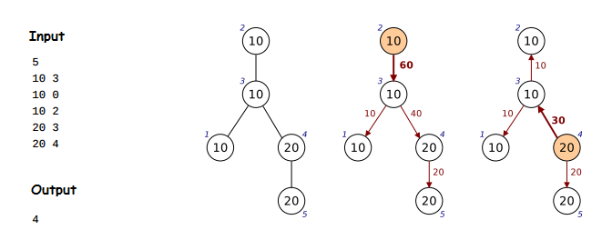

Given a graph, find the balance vertex:

balance vertex=vertex with min {max {sum of subtrees}}

\

## Input
Nodes Number 
Node 
Node 
... 

where 
Node=Value FatherId 

## Output
Id of balance vertex
